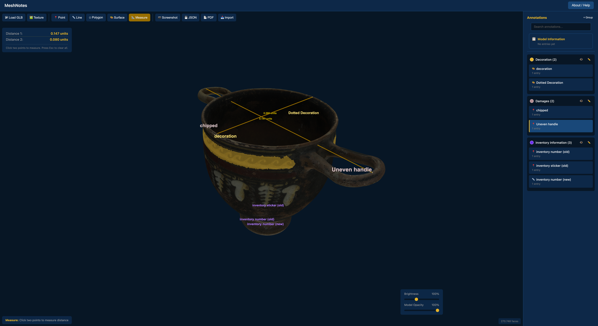

# MeshNotes – 3D Annotation Tool for Research & Heritage

A browser-based tool for annotating 3D models with points, lines, polygons, surfaces, and boxes — designed for cultural heritage documentation.
You can either download the html file and documentation here or use the deployed version at: https://nilsschnorr.github.io/MeshNotes/

## About

**MeshNotes** allows teams to collaboratively mark and describe features on 3D models (photogrammetry, laser-scanning, structured light scanning, etc.) of archaeological sites, architecture, and artifacts (basically any kind of object).

Key features include:
- **Multi-entry annotations** — multiple users can add observations to the same feature with individual timestamps
- **Annotation types** — points, lines, polygons, surface painting, and boxes (lines and polygons can be projected onto the model surface)
- **Measurement tools** — measure distances directly on the model
- **Groups** — organize annotations with customizable colors and visibility toggles
- **Model Information** — add general notes about the entire model
- **Draggable points** — reposition annotation markers without recreating them
- **Search** — filter annotations by name using the search box in the sidebar
- **W3C Web Annotation export/import** — interoperable format (.jsonld) compatible with IIIF viewers and other annotation tools, with UUID-based merging for team collaboration
- **PDF reports** — generate a PDF file for documentation/communication with auto-captured screenshots, axis views, and all information gathered in the annotation process
- **Screenshots** — save the current view as a PNG image with optional scalebar (in orthographic mode)
- **Display controls** — adjust brightness, opacity, point size, text size, and toggle between texture, vertex colors, and gray display modes
- **Light controls** — camera-linked or fixed direction lighting with horizontal/vertical control for raking light analysis

The tool runs entirely in your browser — no installation or server required. Simply open the HTML file and start annotating. Your data stays on your computer unless you share the exported JSON file.

## Getting Started

1. Download and then open `index.html` in a modern web browser (Chrome, Firefox, Edge, or Safari - a chromium-based browser was used for most of the testing)
   Alternatively: use the deployed version of the same file on GitHub Pages: https://nilsschnorr.github.io/MeshNotes/
2. Click **Load Model** to open a 3D model (`.glb`, `.gltf`, `.obj`, or `.ply` format)
3. Use the toolbar to add annotations
4. Export your work as JSON for backup/saving or team collaboration

## Supported File Formats

MeshNotes supports four 3D model formats:

- **GLB/GLTF** (recommended) — Single file (GLB) or folder with linked textures (GLTF). Supports textures, materials, and vertex colors. Best compatibility since it embeds everything in one file.
- **OBJ** — Widely supported format. When loading, you'll be prompted to optionally add material (`.mtl`) and texture files.
- **PLY** — Common for point clouds and laser scans, standard format for tools like GigaMesh. Supports vertex colors natively. You can optionally add a texture image if your PLY contains UV coordinates.

If your model is in another format, convert it to GLB using [Blender](https://www.blender.org/) for best compatibility.

## Model Orientation

Ensure your model is oriented correctly (typically Y-up or Z-up) before exporting. When loading OBJ or PLY files, MeshNotes will ask which axis is "up" in your source software. GLB/GLTF files handle orientation automatically.

**Coordinate system:** MeshNotes displays all models and exports all annotation coordinates with **Z pointing up**, matching the convention used by most cultural heritage, photogrammetry, and geospatial software (Metashape, CloudCompare, MeshLab, QGIS, Blender).

## Usage Tips

- **Single-click** an annotation in the sidebar to focus the camera on it
- **Double-click** to open it for editing
- **Drag annotation points** when no tool is active to reposition them
- **Search** — use the search box in the sidebar to filter annotations by name
- **Surface tool** — Right-click and drag to rotate the view while painting, allowing you to paint continuous surface annotations from multiple angles
- **Box tool** — Drag to move, drag corners to resize, right-click + drag to rotate. Hold Shift while rotating to snap to 15° increments
- **Measurements** are displayed in "units" — the actual unit (meters, millimeters, etc.) depends on how your 3D model was created or exported
- **Camera toggle** — Click "Perspective/Orthographic" in the top-right to switch views; orthographic removes perspective distortion for accurate documentation
- **Fixed light direction** — Switch to fixed lighting mode and use the horizontal/vertical sliders for raking light analysis of surface details like tool marks or inscriptions
- Use the **opacity slider** to see annotations on the back side of the model
- Use the **point size** and **text size** sliders to adjust annotation visibility for your model's scale
- **Screenshots** — Click the Screenshot button to save the current view as a PNG image. In orthographic mode, a scalebar is included automatically.
- **Hide groups** before generating a PDF to exclude them from the report
- Press **Escape** to cancel drawing or clear measurements

## Team Collaboration

MeshNotes supports collaborative workflows through its UUID-based merging system:

1. Load the model and create annotations, then export as JSON
2. Share the JSON file with team members
3. Team members import your JSON, add their own annotations, and export
4. When you import their JSON, new annotations and entries are merged with your existing work — duplicates are detected by UUID and entries with newer timestamps take precedence

This allows multiple people to work on the same model independently, then combine their annotations without losing or duplicating work.

## Export Format

MeshNotes exports annotations in the [W3C Web Annotation Data Model](https://www.w3.org/TR/annotation-model/) format (.jsonld). This standard format ensures:

- **Interoperability** with other annotation tools and viewers
- **Compatibility** with IIIF-based systems used in cultural heritage institutions
- **Future-proofing** through adherence to web standards
- **Extensibility** via custom namespaces for 3D-specific data

The export includes custom selectors for 3D geometry (points, polylines, polygons, mesh faces, and boxes) aligned with the emerging [IIIF 3D specifications](https://github.com/IIIF/3d). Legacy MeshNotes files (.json) can still be imported for backward compatibility.

## Dependencies

MeshNotes uses the following open-source libraries (loaded via CDN):

- [Three.js](https://threejs.org/) (MIT License) — 3D rendering
- [three-mesh-bvh](https://github.com/gkjohnson/three-mesh-bvh) (MIT License) — Accelerated raycasting & surface projection
- [jsPDF](https://github.com/parallax/jsPDF) (MIT License) — PDF generation

## Author

**Nils Schnorr**  
Department of Classical Archaeology  
Saarland University, Saarbrücken, Germany

## License

This project is licensed under the MIT License — see the [LICENSE](LICENSE) file for details.
