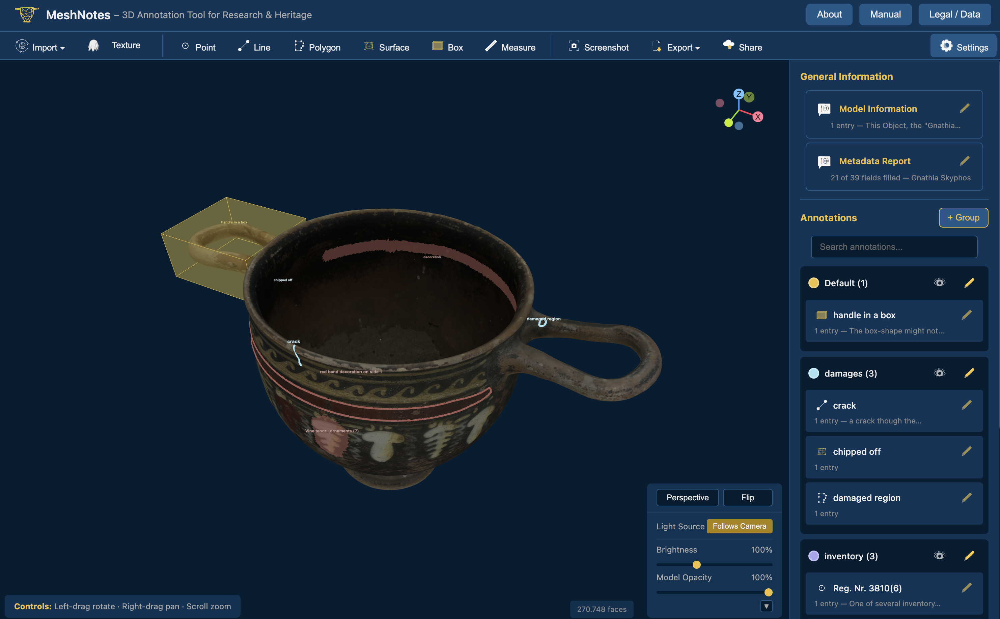

# MeshNotes – 3D Annotation Tool for Research & Heritage

A browser-based tool for annotating 3D models with points, lines, polygons, surfaces, and boxes — designed for cultural heritage documentation.

Use the deployed version at: https://nilsschnorr.github.io/MeshNotes/ — or clone/download the repository to run it locally with a web server.

## About

**MeshNotes** allows teams to collaboratively mark and describe features on 3D models (photogrammetry, laser-scanning, structured light scanning, etc.) of archaeological sites, architecture, and artifacts (basically any kind of object).

Key features include:
- **Multi-entry annotations** — multiple users can add observations to the same feature with individual timestamps and version history
- **Annotation types** — points, lines, polygons, surface painting, and boxes (lines and polygons can be projected onto the model surface)
- **Measurement tools** — measure straight-line distances or multi-point paths (Ctrl+click) directly on the model, with configurable display units
- **Groups** — organize annotations with customizable colors, per-group opacity, and visibility toggles
- **Model Information** — add general notes about the entire model
- **Draggable points** — reposition annotation markers without recreating them
- **Search** — filter annotations by name using the search box in the sidebar
- **Flip View** — rotate the model 180° for easy access to the underside (purely visual, does not affect annotation coordinates or exports)
- **W3C Web Annotation export/import** — interoperable format (.jsonld) compatible with IIIF viewers and other annotation tools, with UUID-based merging for team collaboration
- **PDF reports** — generate a customizable PDF report (page size, orientation, DPI, accent color) with auto-captured screenshots, axis views, and all annotation data
- **Screenshots** — save the current view as a PNG image at selectable quality (1×, 2×, 4×) with optional scalebar (in orthographic mode)
- **Display modes** — cycle through Texture, Vertex Colors, Mesh, and Wireframe views with configurable mesh and wireframe colors
- **Display controls** — adjust brightness, model opacity, point size, text size, and background color (presets or custom)
- **Light controls** — camera-linked or fixed direction lighting with horizontal/vertical control for raking light analysis
- **Settings** — configure default author name, measurement units and colors, screenshot quality, PDF export options, display colors, and background color
- **Tablet support** — optimized for iPad with Apple Pencil: stylus for annotation, fingers for navigation, collapsible sidebar

The tool runs entirely in your browser — your data stays on your computer unless you share the exported JSON file.

## Getting Started

1. **Use the deployed version** at https://nilsschnorr.github.io/MeshNotes/ (recommended)
   
   **Or run locally:** Clone/download this repository and serve it with a local web server (e.g., `python -m http.server` or VS Code Live Server). Opening `index.html` directly via `file://` won't work due to browser security restrictions on ES modules.

2. Click **Load Model** to open a 3D model (`.glb`, `.gltf`, `.obj`, or `.ply` format)
3. Use the toolbar to add annotations
4. Export your work as JSON for backup/saving or team collaboration

## Supported File Formats

MeshNotes supports four 3D model formats:

- **GLB/GLTF** (recommended) — Single file (GLB) or folder with linked textures (GLTF). Supports textures, materials, and vertex colors. Best compatibility since it embeds everything in one file.
- **OBJ** — Widely supported format. When loading, you'll be prompted to optionally add material (`.mtl`) and texture files.
- **PLY** — Common for point clouds and laser scans, standard format for tools like GigaMesh. Supports vertex colors natively. You can optionally add a texture image if your PLY contains UV coordinates.

If your model is in another format, convert it to GLB using [Blender](https://www.blender.org/) for best compatibility.

## Model Orientation

Ensure your model is oriented correctly (typically Y-up or Z-up) before exporting. When loading OBJ or PLY files, MeshNotes will ask which axis is "up" in your source software. GLB/GLTF files handle orientation automatically.

**Coordinate system:** MeshNotes displays all models and exports all annotation coordinates with **Z pointing up**, matching the convention used by most cultural heritage, photogrammetry, and geospatial software (Metashape, CloudCompare, MeshLab, QGIS, Blender).

## Usage Tips

- **Single-click** an annotation in the sidebar to focus the camera on it
- **Double-click** to open it for editing
- **Drag annotation points** when no tool is active to reposition them
- **Search** — use the search box in the sidebar to filter annotations by name
- **Surface tool** — Right-click and drag to rotate the view while painting, allowing you to paint continuous surface annotations from multiple angles
- **Surface projection** — Line and polygon edges are projected onto the model surface by default. Toggle this per annotation in the edit popup
- **Box tool** — Drag to move, drag corners to resize, right-click + drag to rotate. Hold Shift while rotating to snap to 15° increments
- **Multi-point measurement** — Hold Ctrl (Cmd on Mac) while clicking to measure paths through multiple points. Click on a measurement value to copy it to clipboard
- **Flip View** — Click the Flip button to rotate the model 180°. Useful for coins or objects where the back is hard to reach with orbit controls. All annotation data remains in the original coordinate space
- **View Helper** — Click any axis circle in the top-right widget to snap the camera to that standard view direction (e.g., top-down, front, side)
- **Camera toggle** — Click "Perspective/Orthographic" to switch views; orthographic removes perspective distortion for accurate documentation
- **Display modes** — Click the display button to cycle through Texture, Colors, Mesh, and Wireframe views. Mesh and wireframe colors can be customized in Settings
- **Fixed light direction** — Switch to fixed lighting mode and use the horizontal/vertical sliders for raking light analysis of surface details like tool marks or inscriptions
- Use the **opacity slider** to see annotations on the back side of the model
- **Background color** — Choose from preset backgrounds or a custom color in Settings. White backgrounds are ideal for publication screenshots
- **Screenshots** — Click the Screenshot button to save the current view as a PNG image. Choose quality (1×, 2×, 4×) in Settings. In orthographic mode, a scalebar is included automatically
- **Version history** — When you edit an existing annotation entry, the previous version is preserved. View the history by clicking Edit on any entry
- **Settings** — Click the ⚙️ button to configure default author, measurement units/colors, screenshot quality, PDF export options, display colors, and background
- **Hide groups** before generating a PDF to exclude them from the report
- Press **Escape** to cancel drawing or clear measurements

## Team Collaboration

MeshNotes supports collaborative workflows through its UUID-based merging system:

1. Load the model and create annotations, then export as JSON
2. Share the JSON file with team members
3. Team members import your JSON, add their own annotations, and export
4. When you import their JSON, new annotations and entries are merged with your existing work — duplicates are detected by UUID and entries with newer timestamps take precedence

This allows multiple people to work on the same model independently, then combine their annotations without losing or duplicating work.

## Export Format

MeshNotes exports annotations in the [W3C Web Annotation Data Model](https://www.w3.org/TR/annotation-model/) format (.jsonld). This standard format ensures:

- **Interoperability** with other annotation tools and viewers
- **Compatibility** with IIIF-based systems used in cultural heritage institutions
- **Future-proofing** through adherence to web standards
- **Extensibility** via custom namespaces for 3D-specific data

The export includes custom selectors for 3D geometry (points, polylines, polygons, mesh faces, and boxes) aligned with the emerging [IIIF 3D specifications](https://github.com/IIIF/3d). Legacy MeshNotes files (.json) can still be imported for backward compatibility.

## Dependencies

MeshNotes uses the following open-source libraries (loaded via CDN):

- [Three.js](https://threejs.org/) (MIT License) — 3D rendering
- [three-mesh-bvh](https://github.com/gkjohnson/three-mesh-bvh) (MIT License) — Accelerated raycasting & surface projection
- [jsPDF](https://github.com/parallax/jsPDF) (MIT License) — PDF generation

## Author

**Nils Schnorr**  
Department of Classical Archaeology  
Saarland University, Saarbrücken, Germany

## License

Copyright 2026 Nils Schnorr

This project is licensed under the Apache License, Version 2.0 — see the [LICENSE](LICENSE) file for details. You may also obtain a copy of the License at http://www.apache.org/licenses/LICENSE-2.0
